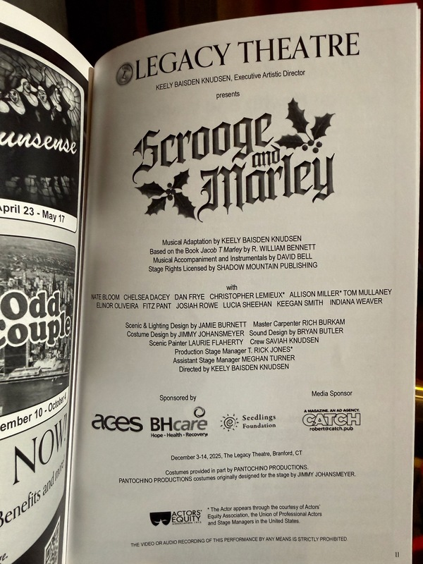

## Part One: The Train to Connecticut

I'm on a train to Connecticut. It's Saturday afternoon, and I'm thinking about a theater review I read this morning.

The reviewer, a high school junior named Ruby Szekeres writing for the Youth Arts Journalism Initiative, covered the world premiere of *Scrooge and Marley* at Legacy Theatre in Branford. The show reimagines *A Christmas Carol* from Jacob Marley's perspective—exploring how he became the man whose ghost sets Dickens' story in motion.

She wrote this about one of the young actors:

> "Pant, an eighth grader at Adams Middle School in Guilford, brought a springy innocence to young Marley that is rarely, if ever, part of his story. Who would have thought this bright-eyed child, who aspired to be just like his father, would become the cheap, miserly villain of Dickens' acclaimed novella?"

That's my son, Fitz.

I called him this morning to congratulate him. He mentioned he had two shows today—a 2pm matinee and a 6:30 call time for the evening performance. When he said 6:30, I realized I could make it.

I've read plenty of words about Fitz—report cards, teacher comments, texts from his mom and stepdad. But this was different. A stranger watched him perform, knew nothing about him except what she saw on stage, and wrote that he brought something to a role that is "rarely, if ever, part of his story."

Not a parent's proud assessment. Not a relative being kind. A reviewer doing her job.

Fitz doesn't know I'm coming. I called his stepdad Pete this afternoon—he and Julie had just watched the 2pm matinee. They got me a ticket for the 6:30 show.

---

## Part Two: What I Saw

It's Sunday morning. I'm still processing what I saw.

I arrived at the theater a little early, wanting to stay low-key. I mentioned to a few people that my son was in the show, but I didn't want to draw attention to myself. Pete had already dropped Fitz off and headed home. Julie asked if I could drive Fitz back after the show. So it was just me, alone in the audience, waiting for the lights to dim.

My seat was in the third row, far left corner, right next to a spiral staircase that turned out to be part of the set. Throughout the show, the narrator and other characters climbed those stairs to deliver lines—sometimes just a few feet from where I sat. But Fitz's roles never brought him to that staircase. A small mercy. I didn't want him to spot me and lose focus.

He never did spot me. Not once.

I found myself in an odd position: wanting desperately to watch my son, to take in every moment of his performance, but also trying not to make eye contact, not to distract him. I would look at him, then look away. Look again. He had no idea I was there.

### What I Saw

Fitz played two named roles—Young Jacob Marley and Tiny Tim—plus ensemble parts, some with speaking lines. Multiple costume changes. The program listed him as "Fitz Pant (Tiny Tim, Young Jacob Marley & Ensemble)."

I've seen him perform before. School plays, community theater. But this felt different.

This was the first time I watched him in a serious role that wasn't written for children. He wasn't a kid playing a kid's part. He was a character in the story—a real character, with weight and purpose in the plot. The person Young Marley becomes as an adult was played by someone else, but the foundation of that character, the innocence that would later curdle into greed, that was Fitz's work to establish.

His singing was strong. His acting was convincing. The reviewer was right: he brought something to Young Marley that the role doesn't usually carry. An earnestness. A boy who genuinely wanted to be like his father.

### "My Son"

There's a song in the show called "My Son." Young Marley and his father, Joseph, stand near the docks where Joseph works. Christmas wreaths. Sprigs of holly. The father sings to his boy.

I sat in the third row and watched my son play a son, singing with his stage father about what fathers hope for their children.

I don't know how to describe what that felt like. I'm not sure I need to.

### The Surprise

After the curtain call, one of the ushers found Fitz backstage and told him there was a surprise waiting for him. Gave him a hint. He figured it out.

He came out and saw me. Gave me a hug. He was beaming.

I was going to take a selfie with him, but another audience member offered to take photos of us instead. As people filed out, some of them congratulated Fitz on his performance. A few congratulated me too—I suppose that's what you do when you meet a performer's parent. I just smiled. I had nothing to do with what happened on that stage.

### The Ride Home

Julie had asked me to drive Fitz back to their house after the show, so we took a car together. It was maybe twenty minutes.

In the car, he told me multiple times how happy he was that I came. How surprised he was. How much it meant to him.

I don't remember exactly what I said back. Probably something inadequate. But I remember thinking: this is it. This is the stuff that matters. Not the performance, not the review—this. A car ride. A conversation. A kid telling his dad he's glad he showed up.

---

## Part Three: The Stranger's Eyes

I started this post talking about a stranger's words. A reviewer who watched my son perform and wrote professionally about what she saw. That moment—reading her assessment on a train, realizing she had no idea whose son she was describing—that's what set all of this in motion.

I'm on a flight to Florida for work. And I'm thinking about something else.

There's a particular kind of loss that comes with raising a child. Not a sad loss—a necessary one. The loss of being the center of their universe. The loss of being the only one who sees them clearly.

When they're young, you're the primary witness to their life. You see their first steps, their first words, their first attempts at everything. You interpret them to the world. You explain who they are.

And then, gradually, other people start to see them too. Teachers. Coaches. Friends. And eventually, strangers. People who have no context, no history, no reason to be generous. People who just see what's in front of them and respond to it honestly.

A reviewer in the New Haven Arts Paper watched my son perform and wrote that he "brought a springy innocence to young Marley that is rarely, if ever, part of his story."

She didn't know she was writing about my kid. She was just doing her job. And in doing her job, she showed me something I couldn't have seen on my own: that my son is becoming a person in the world. Someone who makes impressions on strangers. Someone whose work can be assessed on its own merits, separate from who his parents are.

That's not a loss. That's the whole point.

In the program, in the "Who's Who" section, Fitz wrote his own bio. He noted that "Ever since the first running of *A Christmas Carol*, he wanted to be a part of Legacy's Christmas Show. Last year, he was going to be in it, but a conflict arose. Now he can finally perform in it and he is so enthused." At the end of his bio, he thanks "his parents for all their nurturing and wisdom that they have bestowed upon him in his life."

I didn't teach him to act. I can't sing. I have no wisdom about the theater. Whatever he did on that stage, he did himself.

But I showed up. I took a train to Connecticut to watch him without telling him I was coming. I sat in the third row, in the far corner, and I watched.

Sometimes that's all you can do. Sometimes that's enough.

The next morning, Julie texted me. She said my being there meant a lot to Fitz.

A little while later, I saw a message from Fitz himself, asking if I'd gotten home safely.

---

*Scrooge and Marley runs through December 14 at Legacy Theatre in Branford, Connecticut. [Tickets and information here.](https://www.legacytheatrect.org/scrooge-and-marley)*

*[Read the full review by Ruby Szekeres in the New Haven Arts Paper](https://www.newhavenarts.org/arts-paper/articles/scrooge-and-marley-puts-a-new-spin-on-an-old-redemption-story)*
